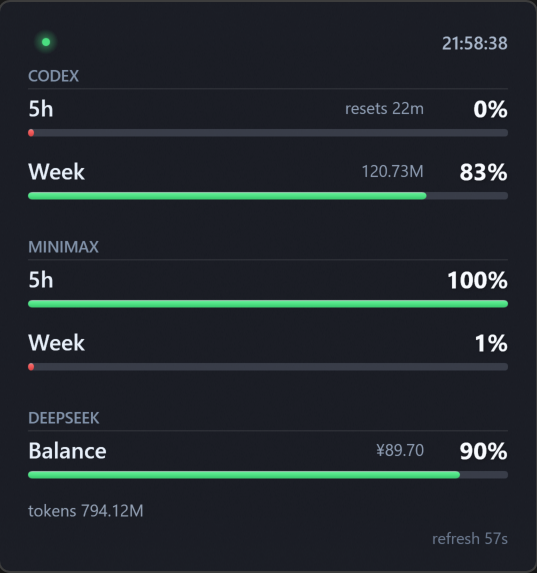

# Token Dashboard

A lightweight Windows desktop dashboard for monitoring AI token plans, quotas, balances, and local usage estimates — single WPF file, zero dependencies beyond the .NET Framework built into Windows.

Currently supports **Codex**, **MiniMax**, and **DeepSeek**.



## Features

- Borderless always-on-top floating panel with native DWM Acrylic glass
- **Codex**: 5h + weekly quota percentages via local `app-server` JSON-RPC + local token estimate from SQLite
- **MiniMax**: 5h + weekly remaining percentage via `mmx` CLI or Token Plan remains API
- **DeepSeek**: balance query via official API with manual fallback, budget-aware progress bar
- Auto-refresh every 60 seconds (configurable)
- Status dot: green (healthy) / yellow (refreshing) / red (unavailable)
- Right-click menu: Refresh, Settings, Always on Top, Exit
- Provider source tracking per snapshot (OfficialApi / Cli / Manual / Cached / LocalEstimate)

## Requirements

- Windows 10 or later (DWM Acrylic support)
- .NET Framework 4.0+ (included with Windows)
- No NuGet, no Python, no Electron

## Build

```powershell
powershell -ExecutionPolicy Bypass -File .\build.ps1
```

Output: `dist\CodexDashboard.exe`

## Run

不需要安装，直接双击 `dist\CodexDashboard.exe` 运行。

```powershell
.\dist\CodexDashboard.exe
```

The widget appears in the top-right corner. Drag anywhere to move. Right-click for menu.

## Provider Configuration

Open **Settings** from the right-click menu.

### Codex

No configuration required. The dashboard reads:
- Local token estimates from `%USERPROFILE%\.codex\state_5.sqlite`
- Official quota from the Codex `app-server` JSON-RPC interface

### MiniMax

- Requires `mmx` CLI installed and signed in
- Optionally enter a **Token Plan subscription key** for the official remains API
- The key is stored in Windows Credential Manager (`CodexDashboard.MiniMaxTokenPlan`), never in `settings.json`

### DeepSeek

- Enter your **API Key** (available at `platform.deepseek.com` → API Keys)
- Choose a balance mode:
  - `autoThenManual` — try the official API first; fall back to your manual balance on failure
  - `officialOnly` — use only the official API; no fallback
  - `manualOnly` — never make a network request
- The key is stored in Windows Credential Manager (`CodexDashboard.DeepSeekApiKey`), never in `settings.json`

## Data Sources

| Provider | Source | Method |
|---|---|---|
| Codex (quota) | Local `codex app-server --stdio` | JSON-RPC `account/rateLimits/read` |
| Codex (tokens) | `%USERPROFILE%\.codex\state_5.sqlite` | Read-only SQLite |
| MiniMax (CLI) | `mmx quota show --output json` | Process + JSON parse |
| MiniMax (API) | `minimaxi.com/v1/token_plan/remains` | HTTPS + Bearer token |
| DeepSeek | `api.deepseek.com/user/balance` | HTTPS + Bearer token |

Local token counts are **estimates only**. Official quota percentages are the source of truth for progress bars.

## Credential Storage

- **Settings**: `%APPDATA%\CodexDashboard\settings.json` (no secrets — only toggles, paths, and budget numbers)
- **API Keys**: Windows Credential Manager (never written to disk as plaintext)

## Privacy

- No telemetry
- No local SQLite data is uploaded
- Network requests are made only to the official Provider APIs listed above — and only when the corresponding Provider is enabled
- All data stays on your machine

## Troubleshooting

**Codex shows 0% or "quota unavailable"**
- Ensure Codex CLI is installed (`codex --version`)
- If installed via npm, the widget locates `%APPDATA%\npm\codex.cmd` automatically

**MiniMax shows 0% or "not configured"**
- Verify `mmx` CLI is installed and you are signed in (`mmx --version`)
- If using the Token Plan API, confirm the subscription key is entered in Settings

**DeepSeek shows no balance**
- Verify your API Key is entered in Settings
- Change the balance mode to `autoThenManual` and set a manual balance as fallback
- Check your balance at `platform.deepseek.com`

## Known Limitations

- The status dot reflects refresh/quota availability; it is not yet a true hook-driven state indicator
- Token usage is an approximate local-thread estimate
- MiniMax `remains_time` display is suppressed when the API returns a raw numeric value with unconfirmed units
- Glass effect depends on DWM support; some Windows builds may show a simpler translucent window

## Roadmap

- [x] Codex 5h + weekly quota
- [x] Local SQLite token estimate
- [x] MiniMax CLI + Token Plan API
- [x] DeepSeek balance with manual/official fallback
- [x] Provider source and stale-data tracking
- [ ] Codex hook-driven status dot (working / approval needed / idle)
- [ ] Configurable refresh interval in Settings UI
- [ ] Window position persistence across restarts
- [ ] Tray icon with minimize-to-tray

---

This project is **not affiliated with or endorsed by OpenAI, MiniMax, or DeepSeek**.
